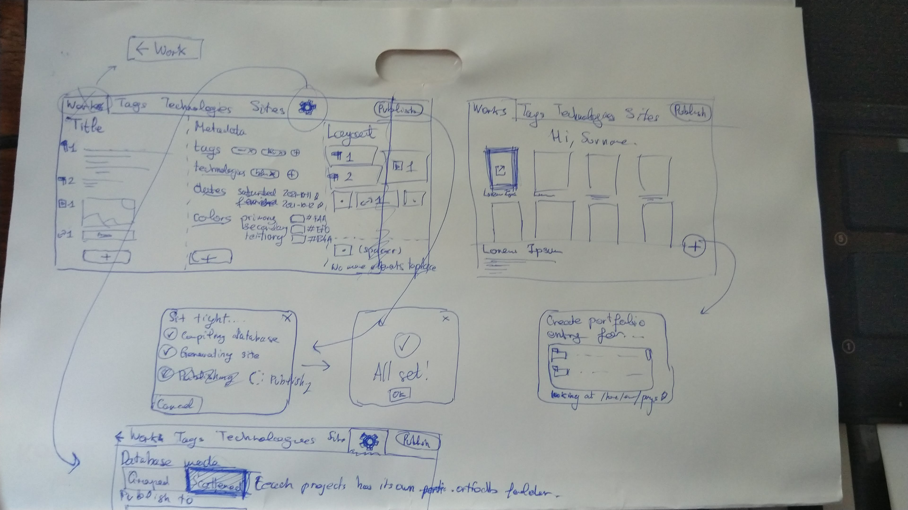
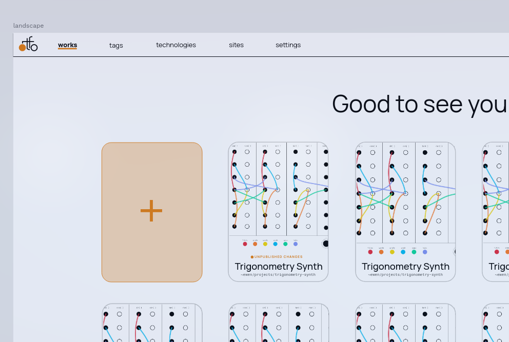

<!-- TODO merge ortfo{gui,db,mk} into a single portfolio entry -->

:: fr

# ortfo (édition graphique)

I am making a graphical user interface for my portfolio creation & management system, [ortfo](/ortfo).

I had some ideas for the interface that I first jotted down on paper, then got to a more detailed prototype in [Penpot](/using/penpot).





[UI Prototype](https://design.penpot.app/#/view/d4ae46d0-37cc-11ec-a516-23056af0be2f?page-id=d4ae46d1-37cc-11ec-a516-23056af0be2f&index=0&share-id=083b11b0-382f-11ec-a516-23056af0be2f)

[Source code](https://github.com/ortfo/gui)

I then started coding it with the Go GUI library [Fyne](/using/fyne). This was my first time programming a graphical user interface, I made a lot of [command-line interfaces](/clis), but graphical ones are way more accessible, and this might make ortfo usable by the general public.

:: en

# ortfo (gui edition)

I am making a graphical user interface for my portfolio creation & management system, [ortfo](/ortfo).

I had some ideas for the interface that I first jotted down on paper, then got to a more detailed prototype in [Penpot](/using/penpot).


[UI Prototype](https://design.penpot.app/#/view/d4ae46d0-37cc-11ec-a516-23056af0be2f?page-id=d4ae46d1-37cc-11ec-a516-23056af0be2f&index=0&share-id=083b11b0-382f-11ec-a516-23056af0be2f)

[Source code](https://github.com/ortfo/gui)

I then started coding it with the Go GUI library [Fyne](/using/fyne). This was my first time programming a graphical user interface, I made a lot of [command-line interfaces](/clis), but graphical ones are way more accessible, and this might make ortfo usable by the general public.

## A more user-friendly way to manage portfolio entries

This application's main goal is to allow writing portfolio entries (i.e. pages describing a portfolio's particular work, just like this one) without any knowledge of Markdown or YAML syntax, but simply with a graphical word processor just like Microsoft Word.

The user then decides the layout (i.e. how blocks of content—paragraphs, media, links—are arranged) by dragging and dropping elements on a grid, without having to write the actual layout specification in YAML, that looks like this:

```yaml
- p
- [p2, m1]
- [p2, m2]
- [l1, l2, m2, m2]
- p
```

where `p`, `m` and `l` stand for paragraph, media and link, respectively. To learn more about this, check out [ortfodb](/ortfodb) and [ortfomk](/ortfomk)
